# Praktikum Modul 1 Jarkom

## Anggota Kelompok

| NRP        | Nama                 |
| ---        | ---                  |
| 5025211058 | Nadya Zuhria Amana   |
| 5025211127 | Nadif Mustafa        |

 

## Daftar Isi

- [Praktikum Modul 1 Jarkom](#praktikum-modul-1-jarkom)
  - [Anggota Kelompok](#anggota-kelompok)
  - [Daftar Isi](#daftar-isi)
  - [Soal 1](#soal-1)
  - [Soal 2](#soal-2)
  - [Soal 3](#soal-3)
  - [Soal 4](#soal-4)
  - [Soal 5](#soal-5)
  - [Soal 6](#soal-6)
  - [Soal 7](#soal-7)
  - [Soal 8](#soal-8)
  - [Soal 9](#soal-9)
  - [Soal 10](#soal-10)

## Soal 1

User melakukan berbagai aktivitas dengan menggunakan protokol FTP. Salah satunya adalah mengunggah suatu file.

- Berapakah sequence number (raw) pada packet yang menunjukkan aktivitas tersebut?
- Berapakah acknowledge number (raw) pada packet yang menunjukkan aktivitas tersebut?
- Berapakah sequence number (raw) pada packet yang menunjukkan response dari aktivitas tersebut?
- Berapakah acknowledge number (raw) pada packet yang menunjukkan response dari aktivitas tersebut?

**Jawaban:**

Karena aktivitas yang dilakukan adalah mengunggah suatu file, maka cari packet dengan yang mengandung kata "STOR".

Didapatkan sequence number dan acknowledgement number dari packet tersebut:

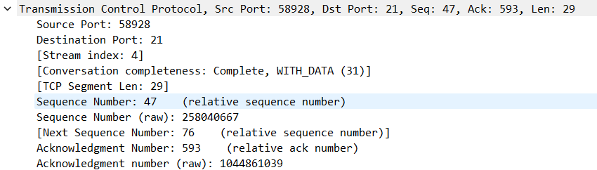

Dari informasi packet di atas, didapatkan bahwa nama file yang dikirim adalah "c75-GrabThePisher.zip", sehinggga kita perlu mencari packet response yang mengandung kata "GrabThePhisher".

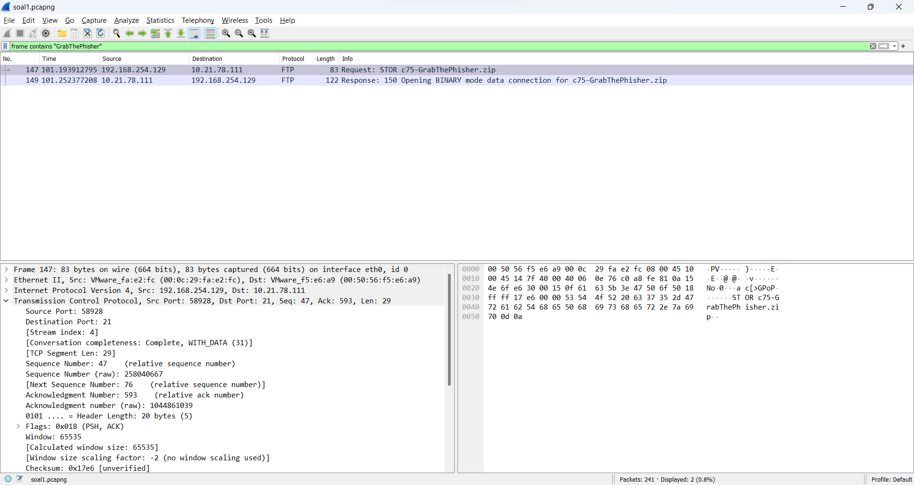

Didapatkan sequence number dan acknowledgement number dari packet tersebut:

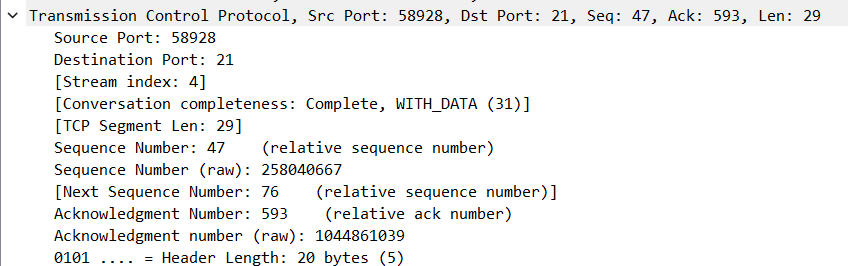

## Soal 2

Sebutkan web server yang digunakan pada portal praktikum Jaringan Komputer!

**Jawaban:**

Lakukan filtering menggunakan ip address portal praktikum jarkom.

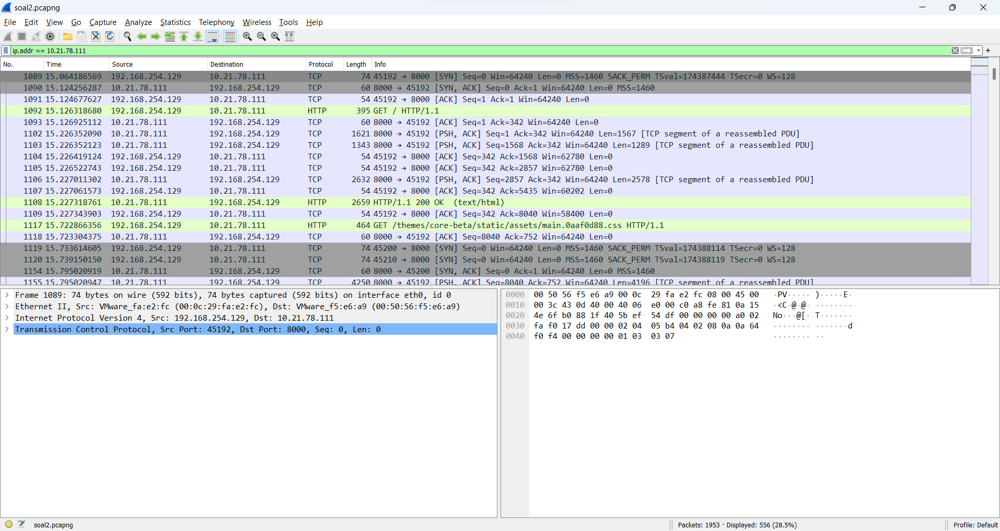

Pilih salah satu packet, kemudian follow tcp stream. Setelah itu, didapatkan bahwa server yang digunakan adalah gunicorn.

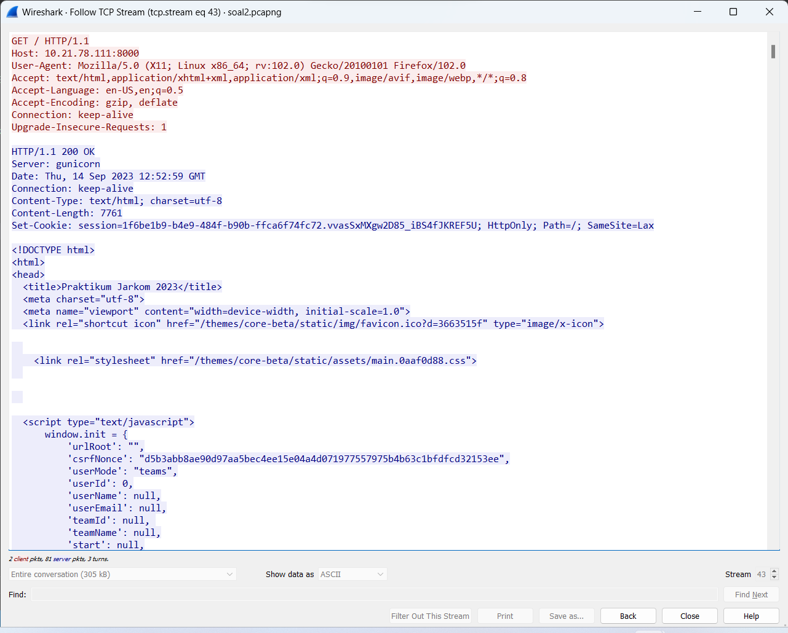

## Soal 3

## Soal 4

Berapa nilai checksum yang didapat dari header pada paket nomor 130?

**Jawaban:**

Cari packet nomor 130, kemudian lihat informasi atribut checksum pada field UDP.

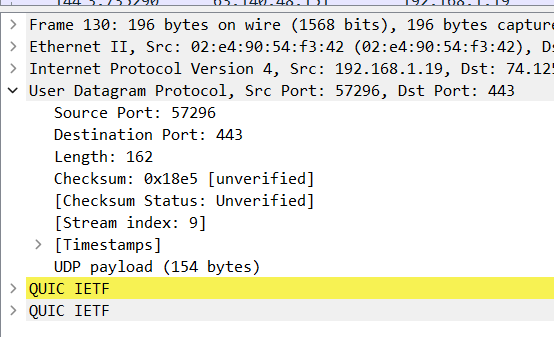

## Soal 5

Elshe menemukan suatu file packet capture yang menarik. Bantulah Elshe untuk menganalisis file packet tersebut.

- Berapa banyak packet yang berhasil dicapture dari file pcap tersebut?
- Port berapakah pada server yang digunakan untuk service SMTP?
- Dari semua alamat IP yang tercapture, IP berapakah yang merupakan public IP?

**Jawaban:**

Pilih packet yang mengandung kata "zip", kemudian lakukan follow TCP stream. Setelah itu, didapatkan informasi seperti ini:

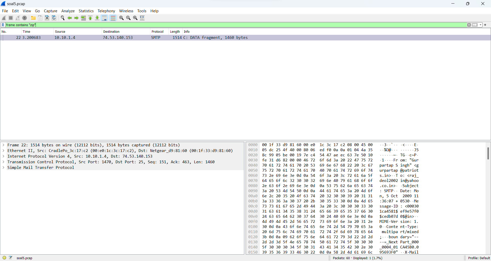

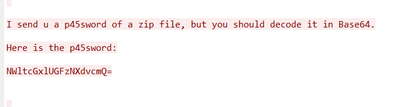

Setelah itu, lakukan decode pada encoded password tersebut, sehingga didapatkan password asli seperti ini:

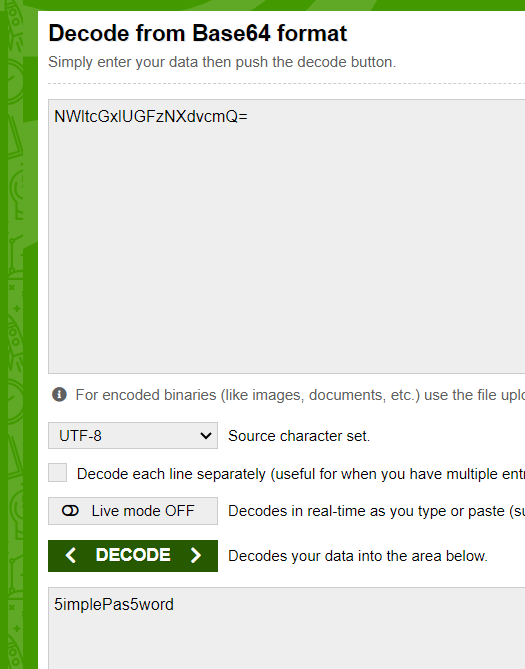

Buka file zip, kemudian buka file txt di dalamnya untuk mendapatkan netcat untuk menjawab soal.

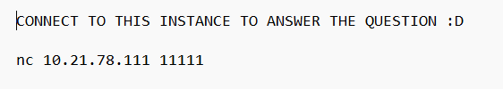

Untuk menjawab subsoal 1 bisa dilakukan secara manual dengan melihat banyaknya packet yang ter-capture.

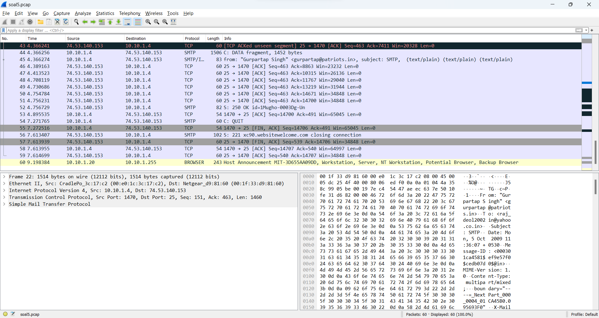

Untuk menjawab subsoal 2, di modul dijelaskan bahwa untuk SMTP port yang digunakan adalah Port 25.

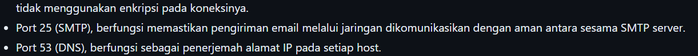

Range dari private ip address adalah sebagai berikut:
- `10.0.0.0` hingga `10.255.255.255`
- `172.16.0.0` hingga `172.31.255.255`
- `192.168.0.0` hingga `192.168.255.255`

Sehingga kita bisa jalankan filter berikut untuk mencari public ip:

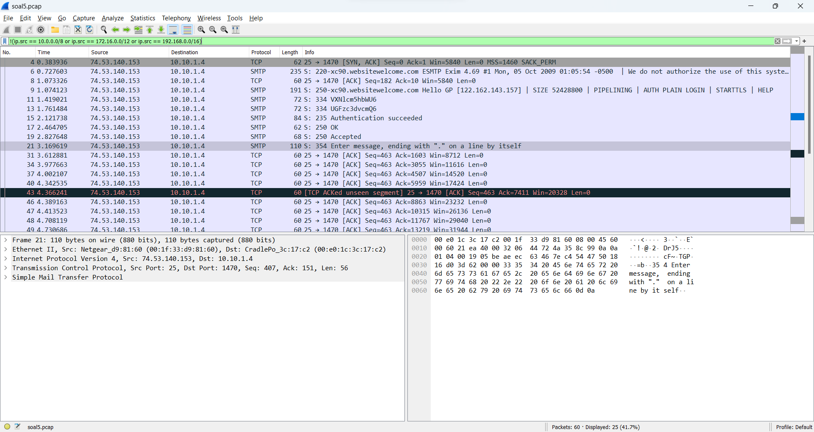

Dari filter tersebut didapatkan bahwa ip yang public adalah `74.53.140.153`.

## Soal 6

## Soal 7

Berapa jumlah packet yang menuju IP 184.87.193.88?

**Jawaban:**

Gunakan filter "ip.dst == 184.887.193.88" untuk mendapatkan packet yang menuju IP tersebut, kemudian dihitung secara manual banyaknya packet yang terfilter.

*Gambar filter*

*Gambar submission*

## Soal 8

Berikan kueri filter sehingga wireshark hanya mengambil semua protokol yang menuju port 80! (Jika terdapat lebih dari 1 port, maka urutkan sesuai dengan abjad)

**Jawaban:**

Filter packet menggunakan dstport 80 untuk mendapatkan packet yang menuju port 80, serta gunakan relasi OR untuk mendapatkan semua packet TCP dan UDP.

*Gambar Submission*

## Soal 9

Berikan kueri filter sehigga wireshark hanya mengambil paket yang berasal dari alamat 10.51.40.1 tetapi tidak menuju ke alamat 10.39.55.34!

**Jawaban:**

Untuk yang berasal menggunakan filter "src", sedangkan untuk menuju menggunakan filter "dst", kemudian gunakan relasi AND.

*Gambar submission*

## Soal 10