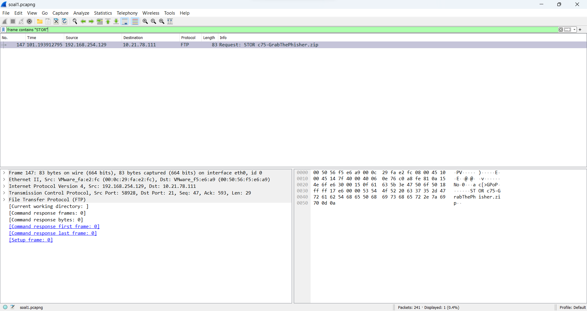

# LAPRES Jarkom-Modul-1-E16-2023

## Anggota Kelompok

| NRP        | Nama                 |
| ---        | ---                  |
| 5025211058 | Nadya Zuhria Amana   |
| 5025211127 | Nadif Mustafa        |

<br>

## Daftar Isi

- [LAPRES Jarkom-Modul-1-E16-2023](#lapres-jarkom-modul-1-e16-2023)
  - [Anggota Kelompok](#anggota-kelompok)
  - [Daftar Isi](#daftar-isi)
  - [SOAL 1](#soal-1)
  - [SOAL 2](#soal-2)
  - [SOAL 3](#soal-3)
    - [Jawaban](#jawaban)
      - [a. Berapa banyak paket yang tercapture dengan IP source maupun destination address adalah 239.255.255.250 dengan port 3702?](#a-berapa-banyak-paket-yang-tercapture-dengan-ip-source-maupun-destination-address-adalah-239255255250-dengan-port-3702)
      - [b. Protokol layer transport apa yang digunakan?](#b-protokol-layer-transport-apa-yang-digunakan)
  - [SOAL 4](#soal-4)
  - [SOAL 5](#soal-5)
  - [SOAL 6](#soal-6)
  - [SOAL 7](#soal-7)
  - [SOAL 8](#soal-8)
  - [SOAL 9](#soal-9)
  - [SOAL 10](#soal-10)
    - [Jawaban](#jawaban-1)

## SOAL 1

User melakukan berbagai aktivitas dengan menggunakan protokol FTP. Salah satunya adalah mengunggah suatu file.

- Berapakah sequence number (raw) pada packet yang menunjukkan aktivitas tersebut?
- Berapakah acknowledge number (raw) pada packet yang menunjukkan aktivitas tersebut?
- Berapakah sequence number (raw) pada packet yang menunjukkan response dari aktivitas tersebut?
- Berapakah acknowledge number (raw) pada packet yang menunjukkan response dari aktivitas tersebut?

**Jawaban:**

Karena aktivitas yang dilakukan adalah mengunggah suatu file, maka cari packet dengan yang mengandung kata "STOR".



Didapatkan sequence number dan acknowledgement number dari packet tersebut:


Dari informasi packet di atas, didapatkan bahwa nama file yang dikirim adalah "c75-GrabThePisher.zip", sehinggga kita perlu mencari packet response yang mengandung kata "GrabThePhisher".


Didapatkan sequence number dan acknowledgement number dari packet tersebut:


## SOAL 2

Sebutkan web server yang digunakan pada portal praktikum Jaringan Komputer!

**Jawaban:**

Lakukan filtering menggunakan ip address portal praktikum jarkom.


Pilih salah satu packet, kemudian follow tcp stream. Setelah itu, didapatkan bahwa server yang digunakan adalah gunicorn.


## SOAL 3

Dapin sedang belajar analisis jaringan. Bantulah Dapin untuk mengerjakan soal berikut:
a. Berapa banyak paket yang tercapture dengan IP source maupun destination address adalah 239.255.255.250 dengan port 3702?
b. Protokol layer transport apa yang digunakan?

### Jawaban
#### a. Berapa banyak paket yang tercapture dengan IP source maupun destination address adalah 239.255.255.250 dengan port 3702?
- ##### Penjelasan
  `(ip.src == 239.255.255.250 && udp.srcport == 3702) || (ip.dst == 239.255.255.250 && udp.dstport == 3702)`, digunakan untuk menyaring paket berdasarkan alamat IP sumber dan tujuan, serta port sumber dan tujuan. 

1. `(ip.src == 239.255.255.250 && udp.srcport == 3702)`: Ini memeriksa paket yang memiliki alamat IP sumber 239.255.255.250 dan port sumber UDP 3702. Ini berarti mencari paket yang dikirim oleh host dengan alamat IP ini dan menggunakan port UDP 3702 sebagai sumber.

2. `(ip.dst == 239.255.255.250 && udp.dstport == 3702)`: Ini memeriksa paket yang memiliki alamat IP tujuan 239.255.255.250 dan port tujuan UDP 3702. Ini berarti mencari paket yang dikirim ke host dengan alamat IP ini dan menggunakan port UDP 3702 sebagai tujuan.

Dengan kombinasi dari kedua kondisi ini (disjungsi dengan `||` yang berarti "atau"), dapat menyaring paket yang terkait dengan lalu lintas yang melibatkan alamat IP 239.255.255.250 dengan port UDP 3702 baik sebagai sumber atau tujuan. Hanya saja satu memeriksa 


- ##### Screenshoot

  

- ##### Kendala
  Tidak ada

#### b. Protokol layer transport apa yang digunakan?
- ##### Penjelasan
 Seperti yang terlihat di packet tersebut bahwa protokol yang di gunakan adalah UDP 
- ##### Screenshoot
  


- ##### Kendala
  Tidak ada

## SOAL 4

Berapa nilai checksum yang didapat dari header pada paket nomor 130?

**Jawaban:**

Cari packet nomor 130, kemudian lihat informasi atribut checksum pada field UDP.


## SOAL 5

Elshe menemukan suatu file packet capture yang menarik. Bantulah Elshe untuk menganalisis file packet tersebut.

- Berapa banyak packet yang berhasil dicapture dari file pcap tersebut?
- Port berapakah pada server yang digunakan untuk service SMTP?
- Dari semua alamat IP yang tercapture, IP berapakah yang merupakan public IP?

**Jawaban:**

Pilih packet yang mengandung kata "zip", kemudian lakukan follow TCP stream. Setelah itu, didapatkan informasi seperti ini:


Setelah itu, lakukan decode pada encoded password tersebut, sehingga didapatkan password asli seperti ini:


Buka file zip, kemudian buka file txt di dalamnya untuk mendapatkan netcat untuk menjawab soal.


Untuk menjawab subsoal 1 bisa dilakukan secara manual dengan melihat banyaknya packet yang ter-capture.


Untuk menjawab subsoal 2, di modul dijelaskan bahwa untuk SMTP port yang digunakan adalah Port 25.


Range dari private ip address adalah sebagai berikut:
- `10.0.0.0` hingga `10.255.255.255`
- `172.16.0.0` hingga `172.31.255.255`
- `192.168.0.0` hingga `192.168.255.255`

Sehingga kita bisa jalankan filter berikut untuk mencari public ip:


Dari filter tersebut didapatkan bahwa ip yang public adalah `74.53.140.153`.


## SOAL 6

## SOAL 7

Berapa jumlah packet yang menuju IP 184.87.193.88?

**Jawaban:**

Gunakan filter `ip.dst == 184.87.193.88` untuk mendapatkan packet yang menuju IP tersebut, kemudian dihitung secara manual banyaknya packet yang terfilter.


*Gambar submission*

## SOAL 8

Berikan kueri filter sehingga wireshark hanya mengambil semua protokol yang menuju port 80! (Jika terdapat lebih dari 1 port, maka urutkan sesuai dengan abjad)

**Jawaban:**

Filter packet menggunakan dstport 80 untuk mendapatkan packet yang menuju port 80, serta gunakan relasi OR untuk mendapatkan semua packet TCP dan UDP. Sehingga filter yang digunakan adalah `tcp.dstport == 80 || udp.dstport == 80`.

## SOAL 9

Berikan kueri filter sehigga wireshark hanya mengambil paket yang berasal dari alamat 10.51.40.1 tetapi tidak menuju ke alamat 10.39.55.34!

**Jawaban:**

Untuk yang berasal menggunakan filter "src", sedangkan untuk menuju menggunakan filter "dst", kemudian gunakan relasi AND. Sehingga filter yang digunakan adalah `ip.src == 10.51.40.1 && ip.dst != 10.39.55.34`.

## SOAL 10

Sebutkan kredensial yang benar ketika user mencoba login menggunakan Telnet

### Jawaban
- ##### Penjelasan
Untuk menemukan kredensial yang benar ketika user mencoba login menggunakan Telnet dalam Wireshark, berikut adalah langkah-langkahnya :
- Buka file capture Wireshark yang berisi riwayat packet saat aktivitas Telnet berlangsung.
- Gunakan "Login" sebagai kata kunci pencarian. Berikut langkah-langkahnya:
   a. Klik pada kolom "Display Filter" di bagian atas jendela Wireshark.
   b. Ketikkan filter berikut dan tekan Enter:
      ```
      telnet && frame contains "Login"
      ```
      Filter ini akan mencari packet Telnet yang mengandung kata "Login."
- Klik pada salah satu packet Telnet yang muncul di daftar.
- Dalam jendela "Packet Details" di bagian bawah, klik kanan pada packet tersebut dan pilih "Follow" > "TCP Stream." Ini akan membuka jendela baru yang menampilkan percakapan Telnet.
- Di dalam jendela TCP Stream, akan ada komunikasi antara client dan server Telnet. Biasanya, username dan password akan muncul di sini.
- Cari bagian yang mengandung informasi login, seperti username dan password. Dan disini muncul, username adalah "dhafin" dan password adalah "kesayangannyak0k0."

        

  
- ##### Screenshoot


  
- ##### Kendala
Sempat salah pada username karena menulis dengan kata aslinya tanpa membedakan warna merah dan biru nyaa, yang awalnya adalah ddhhaaffiinn tapi seharusnya adalah dhafin
